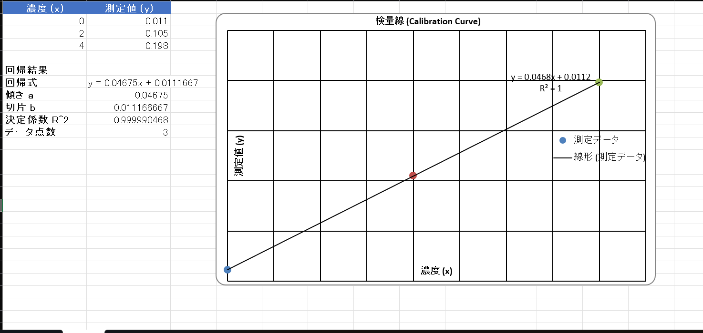

# 検量線自動作成ツール (Standard Curve Generator)

CSV / Excel の測定データを入力するだけで、最小二乗法による検量線（直線 `y = ax + b`）を作成し、回帰式・決定係数 (R²)・グラフを含む Excel レポートを自動生成するコマンドラインツールです。未知サンプルの測定値から濃度を逆算する機能も備えています。

---

## 背景・目的

分子微生物学の実験では、タンパク質定量や核酸定量などで検量線（標準曲線）を頻繁に作成します。通常は Excel に測定値を打ち込み、関数とグラフを毎回手作業で用意しますが、次のような課題があります。

- サンプル数や測定回数が増えると、転記・操作のミスが起きやすい
- 毎回同じ整形作業を繰り返す必要がある
- 解析を他のスクリプトやパイプラインと連携させにくい

本ツールは、測定データを渡すだけで「回帰計算 → レポート出力」までを一括で自動化し、毎回同じ品質の成果物を再現性高く得ることを目的に作成しました。研究室で使っている Python（pandas / scipy）を、実務的な小さなツールとして形にしたものです。

---

## 主な機能

- CSV / Excel ファイルからの測定データ読み込み
- 最小二乗法による直線回帰（傾き・切片・決定係数 R² の算出）
- 散布図＋近似直線（回帰式・R² つき）を埋め込んだ Excel レポートの自動生成
- 未知サンプルの測定値からの濃度逆算
- ファイルを使わず、コマンドラインで手入力する実行モード

---

## 動作環境

- Python 3.9 以上
- pandas / scipy / openpyxl

---

## セットアップ

```bash
git clone https://github.com/yuta-ishikawa-bio/standard-curve.git
cd standard-curve
pip install -r requirements.txt
```

> 仮想環境（venv）の利用を推奨します。

---

## 使い方

### 入力データの形式

1 行目を見出し、2 行目以降にデータを記載します。1列目 = 既知濃度、2列目 = 測定値として扱われます（3列目以降は無視）。

例 (`sample_data/example.csv`):

```csv
concentration,absorbance
0,0.011
2,0.105
4,0.198
6,0.301
```

### 実行例

```bash
# ファイルから検量線を作成
python standard-curve.py --input sample_data/example.csv

# 未知サンプルの濃度を逆算（複数指定可）
python standard-curve.py --input sample_data/example.csv --unknown 0.234 0.512

# 出力ファイル名を指定
python standard-curve.py --input data.xlsx --output result.xlsx

# 手入力モード
python standard-curve.py --manual
```

### オプション一覧

| オプション | 短縮形 | 説明 |
|---|---|---|
| `--input` | `-i` | 入力ファイル (.csv / .xlsx) を指定 |
| `--manual` | `-m` | データを対話的に手入力する |
| `--unknown` | `-u` | 未知サンプルの測定値から濃度を逆算（複数指定可） |
| `--output` | `-o` | 出力 Excel ファイル名（既定: `calibration_result.xlsx`） |

`python standard-curve.py --help` で全オプションを表示できます。

### 出力

実行すると Excel ファイルが生成され、1 つのシートに以下が含まれます。

- 測定データの表
- 回帰結果（回帰式 `y = ax + b`、傾き a、切片 b、決定係数 R²、データ点数）
- 散布図＋近似直線（グラフ上に回帰式と R² を表示）
- `--unknown` 指定時は「測定値 → 推定濃度」の表



---

## 技術的なポイント

- 回帰計算に `scipy.stats.linregress` を採用**：単回帰では scikit-learn より軽量で、傾き・切片・相関係数を一度に取得できるため。
- **CLI を `argparse` で実装：ファイル入力／手入力／濃度逆算／出力名指定をオプションで切り替えられるようにし、再利用しやすくした。
- 回帰結果を `dataclass`（`CalibrationResult`）に集約：回帰パラメータと、予測・逆算のロジックを 1 か所にまとめて見通しを良くした。
- グラフは `openpyxl` のネイティブ散布図：画像の貼り付けではなく、Excel 上で編集できるグラフとして出力し、近似直線・回帰式・R² を表示。
- Excel との使い分け：単発の検量線なら Excel 関数（`SLOPE` / `INTERCEPT` / `RSQ`）の方が速い。本ツールが有効なのは、(1) 同じ測定を反復する、(2) 解析パイプラインに組み込む、(3) 手作業のミスを排除して再現性を担保する、という場面。

---

## 今後の改善予定

- 4 パラメータロジスティック（非線形）曲線への対応（ELISA 等）
- 複数ファイルの一括処理
- GUI 版の提供

---

## 作者

- GitHub: [yuta-ishikawa-bio](https://github.com/yuta-ishikawa-bio)
- バイオ × IT を軸に学習中（分子微生物学 × Python）

---

## ライセンス

本リポジトリは [MIT License](LICENSE) のもとで公開しています。
